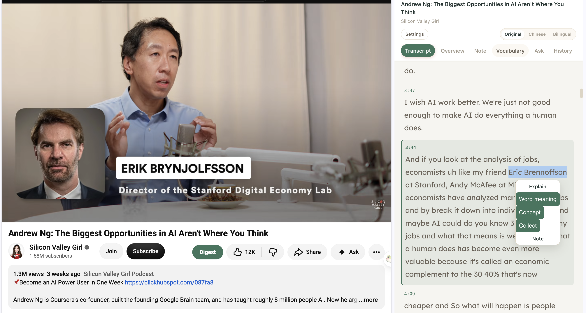
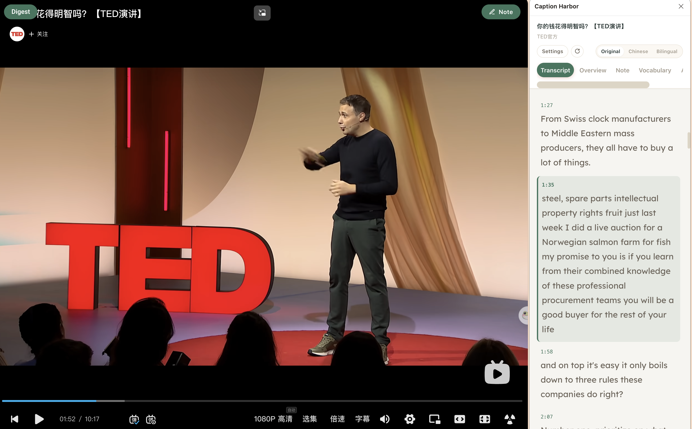

# Caption Harbor

[English](README.md) | [简体中文](README.zh-CN.md) · [下载安装包](https://github.com/SousekiL/caption-harbor/releases)

边看 YouTube、Bilibili 或收听 Apple Podcasts 网页节目，边读字幕、理解概念、积累生词。Caption Harbor 将双语阅读、AI 解释、欧路词典和视频笔记放进同一个浏览器侧栏。

**本项目基于 [Zara Zhang 的 YouTube Digest](https://github.com/zarazhangrui/youtube-digest) 改进，是独立维护的 fork。** 我们保留了她原有的字幕阅读体验，并新增字幕获取方式、本地转录和生词学习流程。原项目的 MIT 许可和署名完整保留；本版本并非 Zara 官方发布。

- 阅读原文、中文或双语字幕，搜索单词和短语。
- 时间戳放在字幕上方，正文使用完整宽度。
- 划词解释、概念说明，保存原句和视频时间点。
- 将收藏的生词同步到欧路词典。
- 读取已有字幕不强制依赖 Supadata；没有字幕时可选云端或本地转录。
- 密钥和学习记录保存在自己的设备上，按需选择外部服务。

插件目前通过 GitHub 本地安装，未上架 Chrome 应用商店，不附赠 API 额度，也没有开发者托管服务器。云端服务独立计费，扩展不会自动更新。当前发布为测试版。





## 哪些来自原版，哪些是本版本的改进？

| 模块 | YouTube Digest 原有基础 | Caption Harbor 的新增与改进 |
| --- | --- | --- |
| 字幕阅读 | 侧栏、时间点跳转、搜索、双语翻译 | 时间戳上置、精简布局、字体字号设置，内置 Roboto Slab 和 Lexend |
| 字幕来源 | Supadata 原生字幕接口 | 直接读取视频页面；本机 yt-dlp 补充获取；不再强制要求 Supadata key |
| 音频转录 | 仅处理已有字幕 | 新增 Supadata、Groq、本地 Whisper 可选转录 |
| 理解内容 | AI 概览、章节、划选解释和笔记 | 区分词义与概念、建议词形、视频追问和理解自测 |
| 生词积累 | 无独立生词流程 | 本地生词本、原句、多视频出处、欧路同步和失败重试 |
| 学习记录 | 笔记与近期缓存 | 视频历史、播放位置、生词与笔记数量 |
| 跟随播放 | 字幕高亮和滚动 | 绑定当前视频取播放位置；视频跳转保持同步，手动滚动字幕才暂停 |
| 设置 | 密钥和设置页语言控制 | 「字幕与 AI」「学习设置」两部分；界面语言统一控制设置页和视频侧栏 |

## 2.1.7 更新

- “词义”结果改为词典式卡片：词头、英／美 IPA 音标、加粗词性、分义项释义、例句及常见搭配。
- 原字幕、改写例句、补充例句明确区分；只有能在本次字幕上下文中找到的文字才标为原字幕。
- 延续独立解释语言设置，纯英文模式不显示中文例句译文；本地收藏与导出保留音标和例句。
- 发音和释义由 AI 生成，不代表引用了外部词典；提示模型在发音不确定时留空。
- 保持原插件目录覆盖更新并重新加载即可，无需重装本机助手。

## 2.1.6 更新

- 划词菜单整合为两行四项：词义、概念、收藏、笔记，统一按钮样式，窄侧栏下不再堆叠换行。
- 设置 → 学习设置 → 查词与解释，可选择“纯英文解释”或“中文解释（英文辅助）”。自动保存，下次查词／概念查询生效。
- 解释语言独立于界面和字幕语言；默认中文解释（英文辅助）。已收藏释义不会被自动改写。
- 本次只需在原目录覆盖更新并重新加载扩展，助手和模型无需重新安装。

## 2.1.5 修复版

- 修复切换视频时旧概览、字幕缓存、笔记筛选和播放操作串到另一个视频的问题。
- 修复问答返回清空新草稿、关闭解释弹窗后仍写入旧弹窗的问题。
- 修复 Apple Podcasts 音频地址解析、本机任务启动及超时状态、音频分段时间轴问题。
- 保留通信中断后结果不明确的转录任务，防止自动重复提交；明确失败仍可重试。
- 重置数据会同时清空设置表单，避免再次保存时恢复已删除的旧密钥。
- AI 默认模型使用 DeepSeek 官方当前推荐的 `deepseek-flash` 标识。

升级时保留原来的扩展目录，在浏览器扩展管理页重新加载，再刷新视频页面。**已安装本机助手的用户必须重新运行对应浏览器的助手安装命令**，因为助手是独立复制安装的。无需重新下载已有 Whisper 模型。

## 2.1.4 更新

- 播放跟随采样由 500ms 缩短为 250ms，跨过字幕边界后会在 350ms 内切换高亮。
- 点击字幕会直接跳转侧栏绑定的 tabId 与 videoId；扩展更新后 content script 失联时，经过视频身份校验的脚本回退会修改该视频播放器，不再静默转发到其他 YouTube 标签。
- 浏览器和本机助手字幕路径都会保留 YouTube JSON3 的词级 `tOffsetMs`，不再按字符比例猜测句内时间。
- 字幕显示时间戳和导出时间轴保持不变。

## 2.1.3 更新

- 在视频侧栏的设置按钮旁增加小型「重新载入字幕」按钮。
- 点击后只清除当前视频可重建的字幕缓存，并重新执行字幕获取流程。
- 保留笔记、生词以及正在进行的 Supadata、Groq 或本地 Whisper 任务，避免重复收费或重复计算。
- Groq／本地音频任务失败后会退出可恢复状态，下一次尝试可以重新检查 YouTube 已有字幕。
- 本机助手即使后续可选翻译轨道被限流，也会使用已经成功下载的英文字幕。

## 2.1.2 更新

- 修复 YouTube 单页切换时，较慢返回的上一个视频结果覆盖当前标题或字幕的问题。
- 元数据、缓存与字幕写入共用同一个导航版本校验，每一步都会丢弃过期异步结果。

## 2.1.1 更新

- 插件图标及视频上的 Digest、Note 按钮统一使用 `#3D755D`。
- 阅读界面保留搜索框、上一条／下一条匹配，以及标题旁的 Copy / Export。
- 移除上一句、暂停／播放、单句循环和字幕文件组成的额外工具栏。
- 重写中英文说明，清楚区分原版基础、本版本改进和不同使用方式。

## 让编程 Agent 帮你安装

可以把仓库链接和下面这段话交给你的编程 Agent：

> 将 https://github.com/SousekiL/caption-harbor 安装到一个长期保留的目录，告诉我浏览器应该加载的准确目录。配置本机助手前，先确认我使用 BrowserOS、BrowserOS neo 还是 Chrome。帮助我选择字幕来源，并让我直接在设置页填写凭据，不要把 key 写进源码或聊天。用我指定的视频验证字幕读取和播放跟随。

如果要用本地转录，再让 Agent 检查电脑算力、内存和模型大小，然后安装需要的组件。能直接读取的视频字幕和 Supadata 路径不强制要求本机助手。

## 手动安装

1. 从 [Releases](https://github.com/SousekiL/caption-harbor/releases) 下载 ZIP 并解压，或克隆仓库。
2. 将文件夹放在长期保留的位置。
3. 在 BrowserOS 或 Chrome 地址栏打开 `chrome://extensions`。
4. 开启「开发者模式」，点击「加载已解压的扩展程序」，选择含 `manifest.json` 的文件夹。
5. 按需固定插件图标，然后打开一个普通的 YouTube 视频页面。
6. 点击插件图标或视频页面上的 Digest 按钮。

更新后，在扩展卡片上点圆形箭头「重新加载」，再打开侧栏。如果视频页面上的按钮仍是旧版，刷新该视频页。移动源码目录可能改变已解压扩展的身份，需要重新加载并重新注册本机助手。

## 配置「字幕与 AI」

右上角 English／Chinese 控制设置页和视频侧栏的界面语言。阅读界面的原文／中文／双语控制字幕内容，两者独立。

插件先检查缓存，再尝试读取 YouTube 页面可用的字幕；安装了本机助手时，还会通过 yt-dlp 补充获取。这些方式不需要 Supadata 或 DeepSeek key，但仍受 YouTube 和视频本身的可访问性影响。

勾选「没有字幕时自动转录音频」后，选择一种方式并保存：

| 方式 | 需要配置 | 使用的资源 |
| --- | --- | --- |
| Supadata | [Supadata API key](https://dash.supadata.ai/) | 云端获取或生成字幕，消耗 Supadata 额度 |
| Groq | [Groq API key](https://console.groq.com/keys)、本机 yt-dlp 和 FFmpeg 助手 | 本机准备音频，上传 Groq 按量转录 |
| 本地 Whisper | 本机助手、whisper.cpp、下载好的模型 | 本机 CPU/GPU 和内存，无转录接口费 |

**[DeepSeek API key](https://platform.deepseek.com/api_keys) 独立配置**，用于翻译、概览、解释、问答和 AI 笔记处理。当前集成为 DeepSeek Flash；只读字幕不需要它。

密钥直接填在设置页。各服务的账号、额度和账单相互独立；开启云端转录前查看 [Supadata 价格](https://supadata.ai/pricing)和 [Groq 转录说明](https://console.groq.com/docs/speech-to-text)。

## 配置本地转录

在安装了 Homebrew 的 macOS 上，进入插件目录后运行：

```sh
python3 scripts/setup-audio.py --model small.en
python3 scripts/install-native-host.py --browser browseros
```

- Chrome 使用 `--browser chrome`；BrowserOS neo 使用 `--browser browseros-neo`。
- 只需要 Groq 的音频准备组件时，用 `--groq-only` 替代 `--model small.en`。
- `base.en`、`small.en` 仅适用于英文；`small` 支持多语言。只有已下载的模型才能运行。
- 自定义安装可向助手安装器传入 `--profile-dir` 和 `--extension-id`。

随后在设置中选择本地 Whisper 和已安装模型，点击「检查本机组件」，保存设置。模型保存在 `~/.config/caption-harbor/models`，不进入仓库或安装包。本地转录会占用内存和算力，可能增加发热与耗电。

助手注册支持 macOS/Linux；依赖安装脚本使用 macOS 的 Homebrew。其他系统需要手动配置组件，详见[本机配置说明](LOCAL-SETUP.html)。

## 配置「学习设置」

### 欧路生词本

1. 选择手动填写，或从本机环境配置读取授权。
2. 手动模式下，在[欧路授权页面](https://my.eudic.net/OpenAPI/Authorization)获取 Token 并填入设置。
3. 点击「保存并读取生词本」，选择目标生词本或新建一个，再保存学习设置。
4. 在字幕中选中单词直接收藏；也可先看词义与建议原形，修改词条后再收藏。

收藏先保存到本地，再尝试同步欧路。同步失败会保留记录并提供重试按钮。欧路收到词条和原句；完整解释、视频链接及其他出现位置保存在插件中。删除本地记录不会删除欧路中的词。

本机环境模式需要安装助手，并将 `EUDIC_TOKEN` 放入 `~/.config/caption-harbor/secrets.env`，设置为仅当前用户可读写的 `0600` 权限。Token 在请求时读取，不复制到浏览器存储；它是应用私有环境文件，不是系统全局设置。

### 字体外观

在设置页选择字体和 12–32 px 字号，原文与译文同步变化并自动保存。Roboto Slab、Lexend 已内置，中文字符回退到系统字体。阅读界面不显示字体配置面板。

## 日常使用

1. 打开 YouTube 视频和插件侧栏。
2. 阅读字幕或切换双语，点击时间点跳转。
3. 输入单词或短语搜索，用箭头切换匹配位置；从标题旁复制或导出当前显示的字幕。
4. 划选文字，查询词义、解释概念、保存笔记或收藏生词。
5. 在「生词」回看原句和视频出处，或重试欧路同步；已收藏词会在字幕中高亮。
6. 在「问答」追问或生成理解题，在「记录」返回之前的视频。

默认持续跟随播放，点击视频进度条不会退出同步。手动滚动字幕会暂停跟随，点「跟随播放」恢复。输入框之外仍可使用高级快捷键：Alt+左箭头回到上一句、Alt+空格暂停／播放、Alt+L 单句循环。

## 当前支持与限制

- 要求 Chromium 116+，已验证 BrowserOS 和 Chrome；不支持 Firefox、Safari 和手机浏览器。
- 支持可读取的已有字幕、本机补充获取和所选音频转录方式。
- 本机音频任务支持公开可访问、最长四小时且源文件不超过 500 MB 的视频；私有、受限视频和正在进行的直播可能失败。
- Groq 按五分钟分段上传，再合并时间戳；分段边界可能影响识别。
- 本机任务可在关闭侧栏后继续；新任务开始时会清理超过 24 小时的旧任务，最多保留十个近期任务。
- 长视频问答会选取有限片段，并说明未覆盖全文。转录和 AI 回答可能存在错误。

YouTube 页面变化或访问限制可能导致获取失败。「视频有字幕」不保证一定能下载。本项目不伪造访问令牌，也不自动导出浏览器账号 Cookie。

## 常见问题

| 情况 | 检查方法 |
| --- | --- |
| 更新后还是旧图标或按钮 | 重新加载扩展；刷新 YouTube 以更新视频页面按钮 |
| 不填 Supadata 就读不到某个视频 | 等待页面加载，检查本机助手，或选择已配置的转录方案 |
| 本地 Whisper 不可用 | 检查组件、所选模型，以及助手是否注册到实际使用的浏览器 |
| 读不到环境 Token | 检查私有文件权限和扩展 ID，并为 BrowserOS 或 Chrome 重新运行对应安装器 |
| 云端额度达到上限 | 检查对应服务账户，或使用已有字幕／已配置的本地 Whisper |
| 字幕没有继续跟随 | 点击「跟随播放」；手动滚动字幕本来就会暂停跟随 |
| 转录任务卡住或结果不明确 | 先核对已有任务，再从设置重置；重置不等于取消，重新提交可能再次收费 |

## 隐私与数据流

- YouTube 通过浏览器或本机助手提供已有字幕和音频。
- 使用 Supadata 路径时，向它发送视频链接。
- 选择 Groq 时才上传音频；key 通过内存传入本机工作进程，不写进任务文件。
- 本地 Whisper 在电脑上处理下载后的音频。
- 使用 AI 功能时，DeepSeek 接收相关文字和上下文。
- 同步生词时，欧路接收词条及原句。

密钥、记录和缓存保存在当前浏览器或本机助手的私有目录。没有项目方托管后台、统计跟踪或自动跨设备备份。删除本地数据前可先导出生词。完整说明见 [PRIVACY.md](PRIVACY.md) 和 [SECURITY.md](SECURITY.md)。

## 开发与验证

```sh
npm ci
npm test
npm run test:native
npx playwright install chromium
npm run test:browser
npm run check
npm run package
```

安装包仅包含明确列入清单的文件。已在 macOS 实测本机字幕获取和短音频 Whisper 转录；浏览器测试覆盖阅读、搜索、语言、持久化与播放。Groq 采用受控响应测试，真实账号调用仍需填写 key 后验证。自动测试不能保证所有视频和服务账号都可用。

问题请提交到[本仓库的 Issues](https://github.com/SousekiL/caption-harbor/issues)，附浏览器版本和复现步骤，不要上传密钥或私人学习资料。请不要将本 fork 的问题提交到 Zara 原项目。

## 许可与致谢

采用 MIT 许可，见 [LICENSE](LICENSE)。感谢 Zara Zhang 和 YouTube Digest 贡献者提供原始基础，本仓库独立维护新增改进。内置字体遵循各自的[许可与署名说明](fonts/README.md)。

## 小红书离线小工具（独立版本）

`minitool/` 为独立的「字幕小港」离线精读版：手动粘贴 SRT、VTT 或普通文本，逐句阅读、搜索、标记已读、收藏生词、记笔记、整理可手动复制的摘录。数据仅在当前工具中缓存。

小红书容器不允许联网、浏览器扩展 API、本机转录、剪贴板读写或文件下载；因此该版本不抓取视频、不调用 AI、不自动翻译、不连接欧路，也不需要 API key。它与桌面扩展分别打包，不能相互替代安装。

```sh
node --test tests/minitool.test.js
npx playwright test tests/browser/minitool.spec.js
npm run package:minitool
```

产物为 `dist/caption-harbor-xiaohongshu-v1.0.0.zip`，根目录直接包含 `index.html`。可提交小红书小工具平台；平台审核、模拟器及 Android 8.1 / WebView 61 真机兼容性需另行验证。
